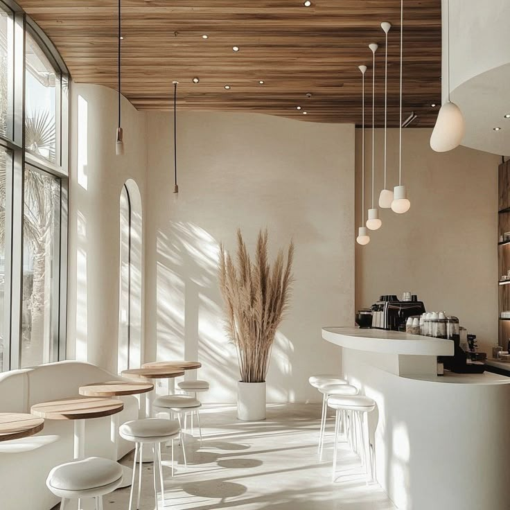

# ☕ Mood-Based Café Finder

A web application designed to help you discover the perfect café in Indore tailored exactly to your current mood, companion, preferred seating arrangement, and food choices.

## 🌟 Features
- **Dynamic Filtering:** Matches cafes based on four dimensions: Mood, Companion, Seating Preference, and Cravings.
- **Beautiful UI/UX:** A stunning, modern, image-driven step-by-step user interface with high-resolution imagery and sleek aesthetics.
- **Database Driven:** Powered by a robust cloud MongoDB database ensuring quick results and endless scaling.
- **Fully Responsive:** Perfectly optimized layout for both mobile and desktop screens.

## 🛠️ Technology Stack
### Frontend
- **HTML5 & CSS3:** For structuring and designing the modern user interface.
- **Vanilla JavaScript:** For interactive DOM manipulation and asynchronous API requests.

### Backend
- **Node.js & Express.js:** Serves as the robust backend engine to process frontend requests.
- **MongoDB Atlas & Mongoose:** A NoSQL cloud database used to store the cafe objects, tags, images, and other metadata.

## 🚀 Getting Started Locally

To run this project on your own machine, follow these instructions:

### Prerequisites
Make sure you have [Node.js](https://nodejs.org/) installed on your machine.

### Installation
1. Clone the repository to your local machine:
   git clone https://github.com/lakshitaporwal28/Cafe-Suggestion.git
2.Navigate into the project folder:
  cd Cafe-Suggestion
3.Install the required Node dependencies:
  npm install
4.Seed the MongoDB Database (Optional if you want to customize your own cafes):
  node insertCafes.js
5.Start the Express development server:
  node server.js
6.Open your browser and go to http://localhost:3000
